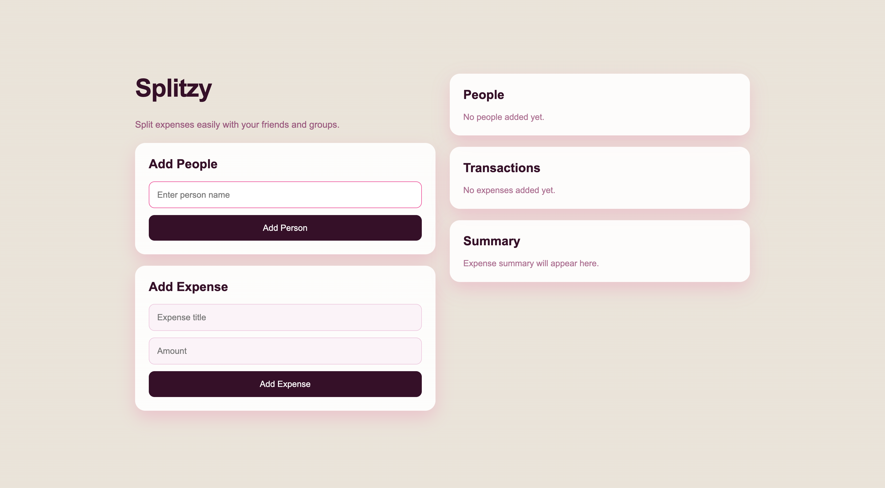
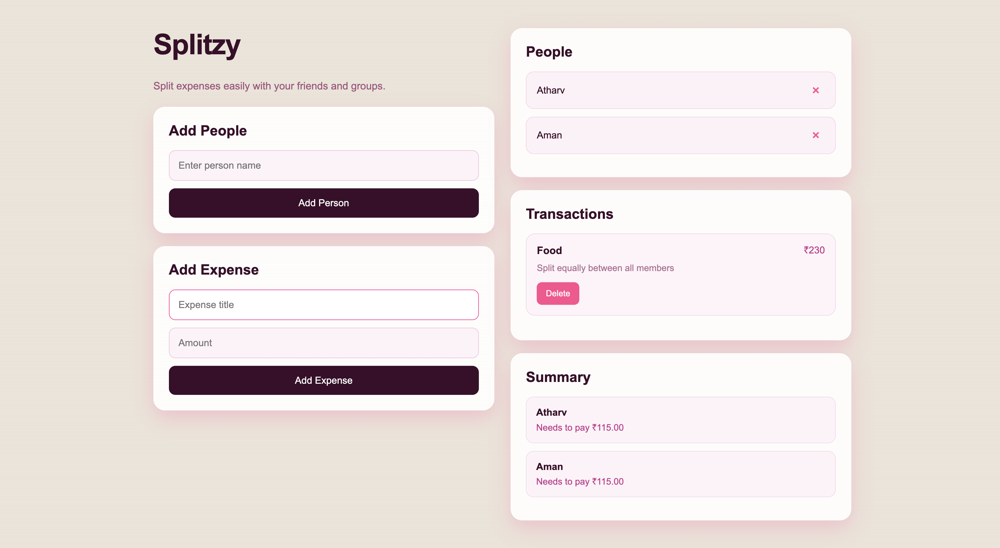

</head>
<body>

<h1>PROJECT TITLE: Splitzy"</h1>

<h3>AUTHOR : ATHARV ANAND</h3>

 

<h2>How To Use The Website</h2>

  It's very easy just open the website and you can  
<li> Add people to your group </li>
<li> Enter expense title and amount</li>
<li> Expenses are automatically divided equally</li>
<li> Summary section shows how much each person needs to pay </li>
<li> All data remains saved after refreshing the page </li>

   

  

  

<h3>Why I made this website ?</h3>

  I made this website because I found it very uneasy to save the expense details on notes whenever I go outside with my friends ,, so I made this site in a specific format to fulfill all the requirements.

<h2>Some cool features</h2>

<ul>
  <li> You can add and remove people instantly</li>
  <li> Can create and manage expenses</li>
  <li> Can Delete transactions anytime</li>
  <li> It automatically equals expense calculation and shows live payment summary updates</li>
  <li> Data will be saved using local storage</li>
  
</ul>

<h2>TECH STACK</h2>

 

 

  
</li>
  

</li>
</ul>
</body>
</html>

